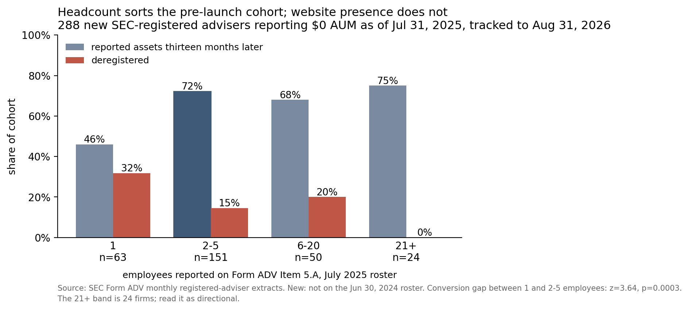
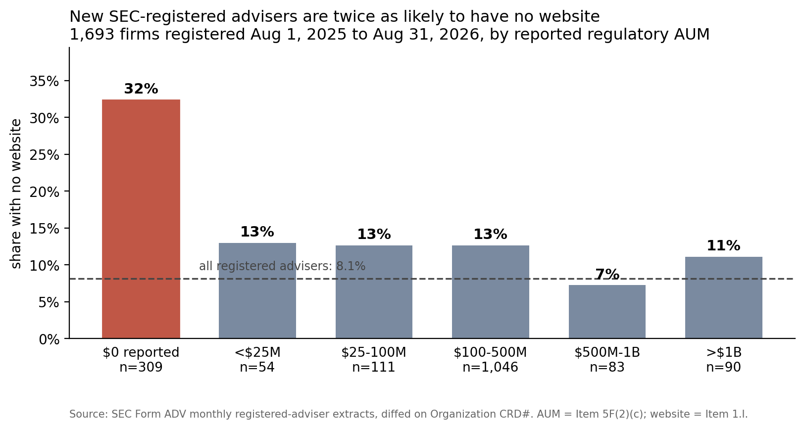

# Two-thirds of pre-launch RIAs had launched thirteen months later

There is a state a registered investment adviser can be in where it exists entirely on
paper. It has a CRD number, an approved SEC registration and a filed brochure. It has no
website and no reported assets. Often one employee. Everything a regulator needs to see
is in place and nothing a client would recognize as a firm is.

On August 31, 2026, 309 of the advisers that had joined the SEC's registered rolls in
the previous thirteen months were in it, reporting exactly $0 in regulatory assets under
management. Just under a third of them, 32.4%, reported no website at all.

That number is why I started looking, and it turned out to be the wrong number to
build on.

## The obvious play

If you sell into RIAs, the pitch writes itself. A firm in this state is weeks away from
buying a custodian, a website, an archiving vendor, compliance tooling and a CRM, mostly
at once, mostly from whoever reaches it first. The SEC publishes the registered adviser
roster monthly. Diff two months, filter to firms reporting no assets, and you have a
list of buyers before they have a procurement process.

The publicly available research in this market does not run on that cut. It runs on
aggregate registrant counts and AUM growth. Same source data, one level of resolution
short of naming a firm you could call. What sits behind the subscription research
programs I can't speak to.

I built the list. Then I checked whether the firms on it become customers.

## The new ones mostly launch

The roster as of July 31, 2025 had 628 registered advisers reporting $0 in AUM. 288 of them
were not on the roster thirteen months earlier: new registrants, found by the same diff run
backwards. Because the same file is published every month, that cohort can be followed
rather than described. Thirteen months later:

- **52 (18.1%)** are no longer SEC-registered at all
- **190 (66.0%)** are still registered and now report assets
- **46 (16.0%)** are still registered and still report $0

Two-thirds of the new registrants, 190 firms, were reporting assets thirteen months on.
Among the firms that survived, 80.5% converted. The ones that did are not marginal
businesses. Their median reported AUM in August 2026 is $200.4M.

The other 340 are why the filter matters. They were already registered in June 2024 and
still reporting $0 in July 2025. Thirteen months later 23 of them, 6.8%, reported assets,
and 252, 74.1%, still reported $0. Pooled, the 628 converted at 33.9%. A list filtered on
$0 AUM alone is mostly firms that were never going to buy.

This is one cohort, one vintage, thirteen months. It is not a general law about advisers,
and a cohort drawn in a different year could behave differently. It is enough to say that
a new-registrant list filtered on $0 assets is roughly two-thirds signal over a
thirteen-month horizon, and the same filter without the registration date is roughly
one-third. A campaign run against the unfiltered version spends most of its effort on
firms that will not have become customers by the time it ends.

## The website is not the qualifier

The obvious way to sort the list is the thing that made it interesting: a firm with no
website looks less finished, so it should be earlier in its build-out and more likely to
be shopping.

That is not what the data shows. Among the 288, firms with no website in July 2025
converted at 65.2% (n=89) against 66.3% for firms that had one (n=199). The gap is about a
point, and nowhere near conventional significance (z = -0.19, p = 0.85). Website presence
does not sort this cohort.

Headcount does. Form ADV Item 5.A is a count of employees, and among the same 288 firms
it separates the outcomes cleanly:

| Employees (July 2025) | n | Converted | Deregistered |
|---|---|---|---|
| 1 | 63 | 46.0% | 31.7% |
| 2–5 | 151 | **72.2%** | 14.6% |
| 6–20 | 50 | 68.0% | 20.0% |
| 21+ | 24 | 75.0% | 0.0% |

A new firm with two to five employees and no assets converts at 72.2%. A solo firm in the
same state converts at 46.0% and deregisters at 31.7%. On conversion that gap is 26.2
points (z = 3.64, p = 0.0003); on deregistration it is 17.2 points (z = 2.88,
p = 0.0039).

The 21+ row is small, 24 firms, and none of them deregistered; read it as directional.

Crossing the two signals gives the screen, though the cells get small enough that the
rates should be read as directional:

| July 2025 profile | n | Converted | Deregistered |
|---|---|---|---|
| No website, 2+ employees | 67 | **74.6%** | 9.0% |
| Website, 2+ employees | 158 | 70.3% | 16.5% |
| Website, 1 employee | 41 | 51.2% | 24.4% |
| No website, 1 employee | 22 | 36.4% | 45.5% |

The best cell on the list is the one that looks least finished: no website, but people on
the payroll. The worst is the solo registrant with no website, which converts at 36.4% and
disappears at 45.5%. Payroll separates a firm that is being built from a registration
someone filed and left.

Of the 89 with $0 AUM and no website in July 2025, 16 deregistered, 41 acquired a website,
and 32 still had none in August 2026.

## Sizing it

Across all 17,149 SEC-registered advisers on August 31, 2026, 1,390 report no website
on their Form ADV. That is 8.1%. Among the 1,693 that registered in the preceding thirteen months,
269 do, or 15.9%. New registrants are about twice as likely as the overall population to
have no web presence, and that gap survives restricting to firms whose own SEC status
effective date confirms them as new registrations rather than re-registrations (15.9%,
see below).

The gap is concentrated. By AUM band, the no-website rate among new registrants is 13.0%
under $25M, 12.6% at $25–100M, 12.6% at $100–500M, 7.2% at $500M–1B and 11.1% above $1B.
It is flat everywhere assets are reported and 32.4% among the firms reporting none. There
is no gradient. One cohort behaves differently from all the others.

One feature of the band distribution is not a finding and should not be presented as one:
61.8% of new registrants fall in the $100–500M band. $100M in regulatory AUM is the
threshold at which an adviser must move from state to SEC registration. That
concentration is the threshold doing its job.

## Method

Two monthly SEC Form ADV registered-adviser extracts, published September 2, 2025 and
September 1, 2026, diffed on Organization CRD#. 16,359 advisers in the first file, 17,149
in the second: 1,693 entered, 903 exited, net +790, which reconciles exactly.

I dated each file by the latest filing it contains. The September 2025 file holds the
same 16,359 firms as the August one and nothing filed after July 31, 2025. It is the July
roster, republished. The window runs thirteen months, August 1, 2025 to August 31, 2026.

The panel adds a third extract, published July 1, 2024, whose latest filing is June 30,
2024: thirteen months before the July roster, the same distance as the follow-up. A firm
reporting $0 on the July 2025 roster that is absent from it is a new registrant and in the
panel. The 340 that are on it are shown for comparison and never pooled in. Converted
means still on the registered roster at August 31, 2026 and reporting assets. Deregistered
means absent from that roster, which covers closing, merging and moving to state
registration alike.

"Entered the SEC's registered rolls" is not the same as "new firm," and the extract
cannot tell the two apart. A large share of these are established state-registered
advisers that crossed $100M and changed regulators. Nothing here should be read as a
count of new businesses.

I checked the diff against each firm's own SEC status effective date: 1,689 of 1,693
(99.8%) carry an effective date on or after August 1, 2025 and are genuine new
registrations. The other 4 are re-registrations or status changes. The no-website result
holds without them, at 15.9%.

AUM is Item 5.F(2)(c) and headcount is Item 5.A. Website is Item 1.I, a yes/no flag
rather than a URL. Reading it as a string inverts the result. Every figure here is
produced by `report_stats.py` in the accompanying repository; sources, checksums and the
full limits list are in `METHOD.md`, and the firm-level CSV is attached.

The SEC publishes these extracts monthly, and the script runs against any pair of months,
so both the cohort and its outcome can be recomputed as new files land.
